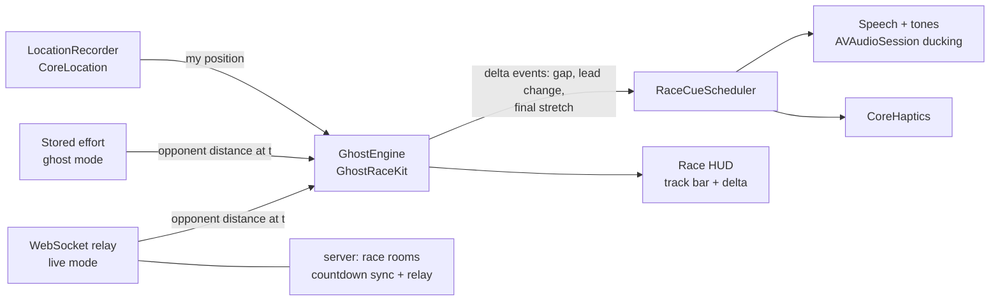

# GhostRace — Mario Kart-style head-to-head fitness racing (research + MVP)

## Context

Record a run/ride segment, challenge a specific friend, and race them with real-time
game-like feedback — audio announcements when behind, jingles when taking the lead,
"Mario Kart for the real world." Two goals: (1) a market research report to validate
the business opportunity, (2) a working prototype. Market scan found the ingredients
exist scattered (Strava Live Segments, Garmin Virtual Partner, Pace To Race, viRACE,
Zwift) but nobody combines **outdoor + head-to-head social challenges + game feel**.
Decisions: build BOTH ghost racing and live races, iPhone native (SwiftUI), running
AND cycling from day one.

## Deliverable 1 — Market research report

Sweep covering: competitor deep-dive (Strava Live Segments, Garmin Race an Activity,
Pace To Race, viRACE, OpenRace, Racefully, Zwift, plus anything newer), market size
for social/virtual fitness racing, why prior entrants stayed small (retention,
two-sided timing problem), monetization patterns (freemium, Strava subscription
precedent), and a differentiation strategy. Output:
- `docs/market-research.md` — full cited report
- Published as an Artifact for easy reading/sharing

## Deliverable 2 — MVP

```
ghost-race/
  docs/market-research.md
  server/                     # TypeScript — fully tested in-session
    src/  tests/  package.json  tsconfig.json
  ios/
    project.yml               # XcodeGen → GhostRace.xcodeproj
    GhostRaceKit/             # SwiftPM package: pure domain logic + Swift Testing tests
    GhostRace/                # SwiftUI app (UI, CoreLocation, audio, networking)
    Fixtures/                 # GPX files for simulator playback + tests
  README.md                   # Mac setup + verification checklist
```

### Architecture spine — one race engine for both modes

The key structural bet: a **live opponent is just a ghost whose data arrives over a
WebSocket instead of from disk**. Both modes feed the same engine; audio/haptics/HUD
subscribe to its events.



### Server (`server/`)

`"type": "module"`, `tsc` build, `node --test` unit tests. Minimal deps:
`better-sqlite3` (zero-infra persistence, swappable later) + `ws`. Plain `node:http`
with a small router module — the REST surface is too small to justify a framework.

- **Data model**: `users` (device-token auth for MVP), `segments` (polyline +
  start/finish gates), `efforts` (time-series of distance-along-segment points),
  `challenges` (creator effort → invitee, status lifecycle), `results` (head-to-head
  record per rival pair).
- **REST**: register device, segments/efforts CRUD (effort upload = batch of `{t, d}`
  points), challenge create/accept/get (accept via shareable link token — push
  deferred to v2), result post.
- **WebSocket race rooms** (`/race/:id`): join → both-ready → server-timestamped
  countdown → position relay (`{t, d}`) → finish → result persistence. Disconnect
  grace window (opponent keeps racing against last-known interpolation; room closes
  after timeout).
- **Tests**: data layer round-trips, challenge lifecycle, race-room state machine with
  fake sockets, and an integration test that boots the server on an ephemeral port and
  runs a **full scripted live race** — two WS clients replaying different-pace tracks,
  asserting countdown sync, relay ordering, and correct winner.

### iOS domain package (`ios/GhostRaceKit/`) — pure Swift, no CoreLocation import

Domain logic uses its own `Coordinate` struct and Foundation-only math, so it's
UI-framework-free and unit-testable in isolation.

- `Geo.swift` — haversine distance, point-to-polyline projection → distance-along-segment
- `Models.swift` — segment/effort models; a recorded effort defines a segment
- `GateDetector.swift` — radius-based start/finish crossing with hysteresis +
  minimum-distance-travelled guard (the classic GPS-noise-at-the-gate problem)
- `GhostEngine.swift` — per-tick: my distance-along-segment vs. opponent's interpolated
  distance at same elapsed time → delta in meters and seconds; emits events (gap
  thresholds, took/lost lead, final stretch)
- `RaceCueScheduler.swift` — turns engine events into rate-limited cue commands (no
  announcement spam; escalating tempo near finish)
- **Swift Testing tests**: distance mapping, interpolation, delta math, gate detection
  edge cases (GPS jitter at gate, out-and-back), lead-change event ordering

### iOS app (`ios/GhostRace/`) — SwiftUI, iOS 17+

- `LocationRecorder` — CoreLocation with background updates (`UIBackgroundModes:
  location, audio`), activity type run vs. ride (GPS filter + pace math differ)
- `AudioCueEngine` — AVSpeechSynthesizer announcements ("15 meters behind Alex") +
  generated tone cues (behind = warning beeps, taking lead = jingle), AVAudioSession
  ducking so it plays over the user's music; `HapticEngine` with distinct
  overtaking/overtaken patterns
- Networking — REST client + `URLSessionWebSocketTask` live-race client feeding `GhostEngine`
- Screens: Home/Rivals (head-to-head records — "you lead the series 3–2"), Record,
  Segment detail → "Challenge a friend" (share-sheet link), Race HUD (Mario Kart-style
  track bar, delta readout, live pace — glanceable), Countdown, Results (+ rematch,
  winner taunt sound)
- Gamification light in v1: jingles, rival records, taunts. Power-ups/catch-up boosts
  noted as v2.
- `project.yml` (XcodeGen) wiring app + GhostRaceKit + test target, Info.plist
  background modes and location-usage strings, URL scheme for challenge deep links

### Build order

1. Market research sweep → `docs/market-research.md` + Artifact
2. Server: scaffold, data model, REST + tests — *verify green*
3. Server: WS race rooms + scripted-race integration test — *verify green*
4. `GhostRaceKit` domain + Swift Testing tests + GPX fixtures
5. iOS app: recording → ghost race (engine + audio/haptics + HUD) → challenge flow →
   live mode client
6. XcodeGen config, README with Mac verification checklist

## Verification

**Machine-verified (any Node env):** server `npm run check` + full `node --test` suite
including the scripted two-client live race; GPX fixtures validated by replaying them
through a JS twin of the geo/delta math (shared JSON expected-values fixture keeps the
Swift and JS implementations honest).

**On a Mac (README checklist, in order):**
1. `brew install xcodegen && cd ios && xcodegen generate` → open project, run
   GhostRaceKit tests
2. Simulator ghost race end-to-end: Xcode GPX playback of the "live run" fixture racing
   the "ghost" fixture — audio cues fire at the right deltas, correct winner
3. Live mode: two simulators (or simulator + device) against `npm run dev` local server
   — countdown sync + real-time deltas
4. Real world: record a segment, challenge yourself, race your own ghost — the true
   GPS-accuracy and audio-feel test

## Risks

- **Swift authored without a compiler in the build container.** Mitigated by pure/simple
  domain logic, tests written up front, and the shared JSON fixture cross-check — expect
  minor fixups on first Mac build.
- Background GPS + audio behavior and battery need real-device testing; the simulator
  validates logic only.
- GPS noise at gates is the known hard problem — hysteresis + min-distance guards in
  `GateDetector`, tuned later with real tracks.
- TestFlight distribution needs an Apple Developer account; not required for running on
  your own device via Xcode free provisioning.
